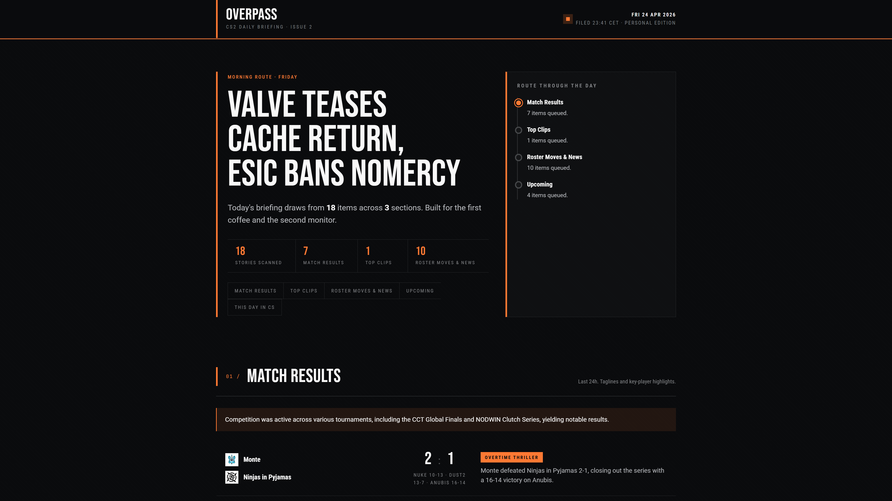

# Overpass

A personal CS2 daily briefing and live alert system, delivered via Telegram.


> *Example daily briefing — dark-themed mobile-first HTML UI*

[](LICENSE)


---

## What it does

Overpass runs every morning, collecting CS2 data from multiple sources — match results, upcoming fixtures, news, Reddit highlights, YouTube uploads, podcasts, and Steam announcements. It feeds everything through an LLM editorial layer that writes a structured daily briefing, renders it as a self-contained HTML file, and pushes a Telegram notification with a one-line summary and a link.

It also includes a "This Day in CS" section: a daily historic moment drawn from a hand-curated YAML dataset covering significant moments in Counter-Strike history. Live alerts for configurable triggers (team results, roster moves, etc.) are in progress.

---

## Data sources

| Source | Method | Status |
|---|---|---|
| HLTV | Playwright scraper (custom) | ⚠️ Experimental — anti-scrape measures may break this |
| Liquipedia | MediaWiki API | ✅ Stable |
| Reddit (r/GlobalOffensive) | JSON endpoint | ✅ Stable |
| YouTube | Data API v3 | ✅ Stable |
| Podcasts | RSS / feedparser | ✅ Stable |
| Steam | ISteamNews API | ✅ Stable |
| Twitter/X | Nitter RSS | ⚠️ Experimental — Nitter availability varies — disabled by default, opt-in via `config.yaml` |
| This Day in CS | Curated YAML | ✅ Stable |

---

## Requirements

- Python 3.12+
- A Telegram bot token and chat ID
- API keys: Gemini (default LLM), YouTube Data API v3, Reddit (no OAuth needed — JSON endpoint only)
- Liquipedia contact info (required by their API terms)
- Playwright browsers installed (`playwright install chromium`) — needed for HLTV scraping

---

## Setup

1. Clone the repo:
   ```bash
   git clone https://github.com/lindhammer/overpass.git
   cd overpass
   ```

2. Create and activate a virtual environment:
   ```bash
   python -m venv .venv
   source .venv/bin/activate      # Linux/macOS
   .venv\Scripts\activate         # Windows
   ```

3. Install the package:
   ```bash
   pip install -e .
   ```

4. Install the Playwright browser:
   ```bash
   playwright install chromium
   ```

5. Copy the config template and fill in your settings:
   ```bash
   cp config.example.yaml config.yaml
   ```

6. Copy the env template and fill in your API keys and tokens:
   ```bash
   cp .env.example .env
   ```

7. Run:
   ```bash
   overpass
   # or: python -m overpass.main
   ```

---

## Configuration

`config.yaml` controls your watchlist teams, tracked channels, schedule, and LLM provider. See `config.example.yaml` for a fully annotated reference — every field is documented there.

Required environment variables (set in `.env`):

```
GEMINI_API_KEY
YOUTUBE_API_KEY
TELEGRAM_BOT_TOKEN
TELEGRAM_CHAT_ID
ANTHROPIC_API_KEY  # optional — Claude support is scaffolded but not yet selectable as a provider
```

---

## Architecture overview

Overpass is a three-layer pipeline: **Collectors** pull raw data from external sources in parallel; the **Editorial** layer passes collected items through an LLM to produce structured, readable summaries; the **Delivery** layer renders a self-contained HTML briefing and sends a Telegram notification. The LLM layer is provider-agnostic and defaults to Gemini (free tier). Claude support is scaffolded but not yet selectable as a provider.

---

## Project status

**Working:**
- Daily digest pipeline end-to-end
- HTML briefing generation
- Telegram delivery
- Liquipedia, Reddit, YouTube, Steam, Podcast, and This Day in CS collectors
- HLTV scraper (brittle — see caveats)

**In progress / coming:**
- Live alerts
- Briefing archive UI
- Historical stats for LLM context
- Twitter/X integration (evaluating options)
- Docker deployment config for self-hosting

**Not started:**
- Claude as alternative LLM provider (interface exists, not wired up)

---

## Scraper caveats

> ⚠️ **HLTV scraping is fragile.** The HLTV collector uses Playwright and may break at any time due to anti-scrape measures, rate limiting, or layout changes. When HLTV is unavailable, Liquipedia is used as an automatic fallback for match data.

> ⚠️ **Nitter (Twitter/X) availability is unreliable.** The social collector will fail gracefully if no reachable Nitter instance is configured — it won't take the rest of the pipeline down. It is disabled by default; enable it in `config.yaml`.

This tool is built for personal use. Please be respectful of rate limits and API terms of service.

---

## Contributing

Contributions are welcome. For anything beyond small fixes, please open an issue first so we can discuss the approach. This is a personal hobby project — response times may vary.

---

## License

[AGPL-3.0-or-later](LICENSE)
